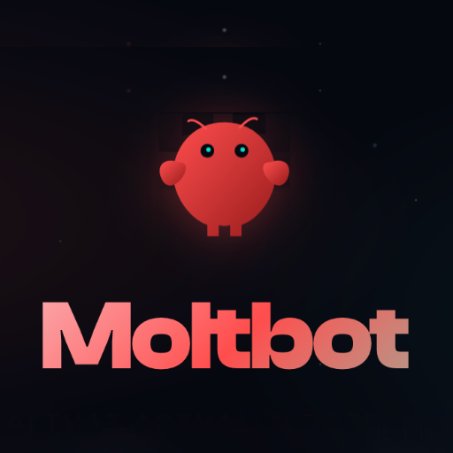

# Awesome AI Operators 😈
A curated list of AI Operators — autonomous systems that use software the same way humans do.

## What is an AI Operator?

An AI Operator is a system that:

- Perceives UI state (screenshots / window context / DOM)
- Executes real actions (click, type, scroll, drag, submit)
- Maintains state across steps
- Recovers from failures
- Operates inside sandboxed or permissioned environments
- Completes workflows end-to-end

> Agents reason.  
> Operators act.

---

## Contents

- [Open-Source AI Operators](#open-source-ai-operators)
- [Closed-Source AI Operators](#closed-source-ai-operators)

---

## [Moltbot](https://github.com/moltbot/moltbot)

**Category:**  
AI Operator · Autonomous System · Local Runtime

**Description:**

- **Autonomous execution** – completes multi-step tasks end-to-end  
- **Real environment control** – operates in browsers and operating systems  
- **Persistent system** – designed to run continuously  
- **State & recovery** – maintains execution context and recovers from failures  
- **Skill system** – modular capability expansion  
- **Security-aware** – supports isolation and permission boundaries  

**Links:**

- GitHub: https://github.com/moltbot/moltbot  
- Documentation: https://docs.molt.bot/start/getting-started
- Community: https://discord.com/invite/clawd

---

## Closed-Source AI Operators

This section tracks proprietary and enterprise-grade AI operator systems.

---

## [Twin](https://twin.so)

**Category:**  
AI Operator · Autonomous System · Cloud Runtime

**Description:**

- **Autonomous execution** – completes multi-step tasks in real environments  
- **Human-like memory** – retains important context across hundreds of tasks and forgets irrelevant details  
- **Adaptive models** – switches to smaller models after learning workflows to reduce cost (~1/10th runtime cost)  
- **Cloud-native** – runs remotely, no local setup or device dependency  
- **Instant onboarding** – sign up and operate immediately  
- **Scalable by design** – supports parallel execution and workload scaling  
- **Security-first architecture** – built with isolation and controlled execution from day one  

**Links:**

- Website: https://twin.so  
- Documentation: —  
- Community: —  

---

---

### Inclusion Criteria

Projects must:

- Execute actions in real environments (e.g., operating systems, browsers, or applications)
- Autonomously complete multi-step tasks end-to-end  
- Run as a persistent system, not a one-off demo or research prototype  
- Maintain execution state and recover from partial failures  
- Support isolation, permissions, or controlled execution boundaries  

---

## Contributing

This list is intentionally strict.

If your project does not **operate computers**, it does not belong here.

See `CONTRIBUTING.md`.

---

## License

CC0 — public domain.

---

> The moment software can use software, labor becomes infrastructure.
